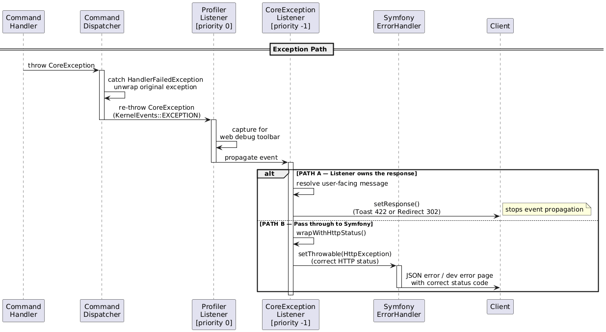

# Exceptions and error handling

Exception and error handling generally follows the standards symfony route, 
however there are a few differences.

## The CoreException and it's interfaces

We have a class, called `CoreException`, this implements 3 interfaces:

- `ContextCarrierExceptionInterface`
  - This indicated if this exception is carry additional context, this context is
    logged by default by the application and dont displayed to the user
- `HttpStatusCodeCarrierInterface`
  - This interface indicates that this exception provides HTTP status codes, that should be
    used to respond
- `UserFacingExceptionInterface`
  - This indicated that the exception **can** provide user facing message

## Listeners

### `CoreExceptionListener`

A simplified diagram of the exception flow and how this listener process it

